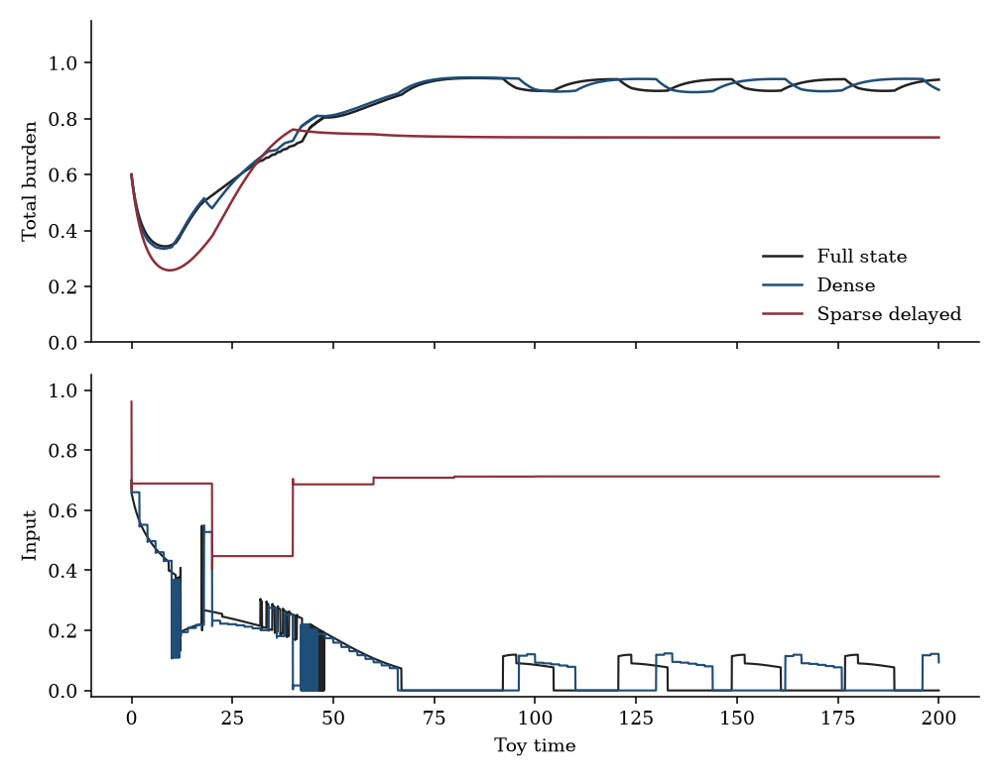
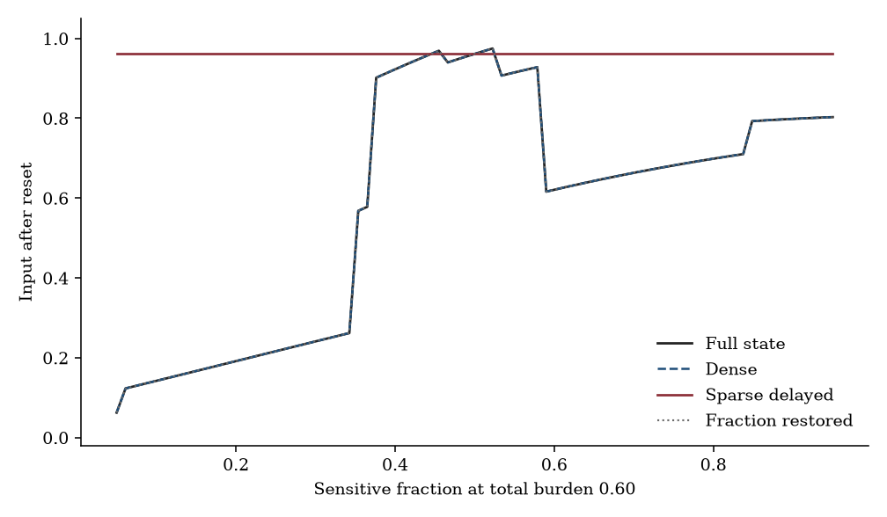
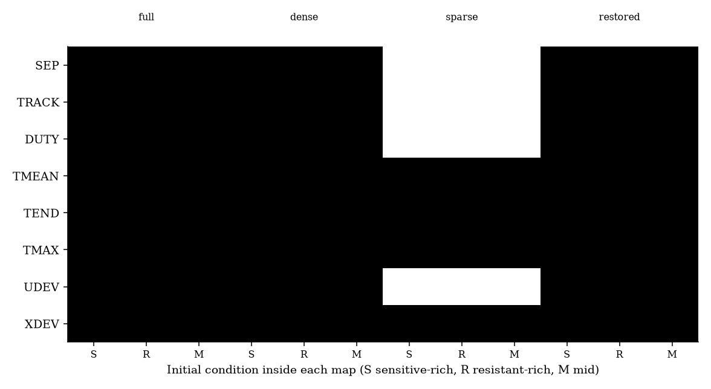
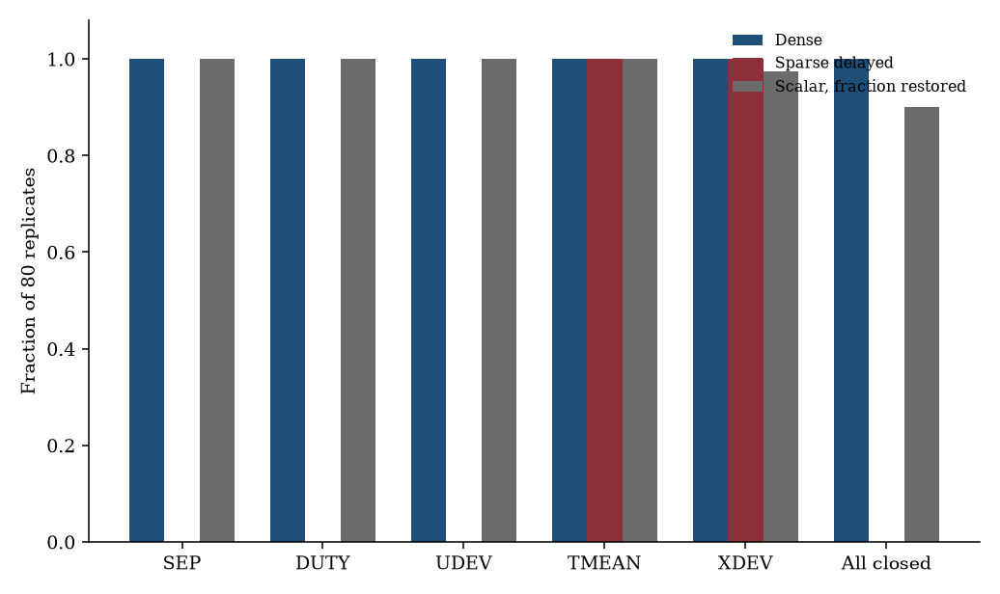

# Sparse connectome controllers under a sparse delayed liquid-biopsy-style observer

**Thesis #27. Computational research thesis**  
**Depends on:** Thesis #6 and Thesis #20  
**Author:** Kelechi Emeka Ogbonna  
**Correspondence:** kelechiogbonna300@gmail.com · https://github.com/cloudynirvana/thesis-27-sparse-controllers-partial-lb-observer  
**Date:** 21 September 2026  
**Format:** B.Sc. project chapters (Nile University style), written as a computational methods manuscript  
**Status:** A joint controller and observer reading on one two-clone toy, plus a seeded numerical check. Not a controller for a patient.  
**Citation style:** numbered Vancouver. A `doi:` field appears only where Crossref returned the record.  
**DOI:** none for this document. Do not invent one.

---

## Title page

**SPARSE CONNECTOME CONTROLLERS UNDER A SPARSE DELAYED LIQUID-BIOPSY-STYLE OBSERVER**

BY

**KELECHI EMEKA OGBONNA**

A COMPUTATIONAL RESEARCH THESIS  
(IN-SILICO JOINT READING OF A FROZEN SPARSE CONTROLLER AND A PARTIAL OBSERVER)

SUBMITTED AS A CITEABLE MANUSCRIPT FOR JOURNAL / THESIS HANDOFF

PROJECT CONFLUENCE  
INDEPENDENT COMPUTATIONAL RESEARCH

SUPERVISOR: not appointed for this deposit

SEPTEMBER 2026

---

## Declaration

I, Kelechi Emeka Ogbonna, declare that this computational research thesis was carried out by me. The steering calls, duties, and deviations reported here were produced by `sim/joint_toy.py`. The controller seed is 20260921. Observation noise uses two streams spawned from `SeedSequence(20260921)`, which do not redraw the expansion. The numbers are not wet-lab measurements and not patient outcomes. No DOI, ORCID, or journal acceptance was invented for this document. No closed-loop table was copied from Thesis #6, and no mode-error table was copied from Thesis #20.

_________________________     _______________________  
Kelechi Emeka Ogbonna         Date

---

## Abstract

Can sparse connectome-style controllers designed under full or dense observation still meet their declared steering bounds when the only map is the sparse delayed liquid-biopsy-style partial observer of Thesis #20?

They cannot. The shared object is one frozen sparse controller on a two-clone competitive plant. The expansion, the claw count, the population sparseness, the ridge readout, and the composition-aware training target are those of Thesis #6. The online maps use the clocks, the lag, the noise scales, and the floor of Thesis #20. The scalar is a linear lag of total burden. It is not a ctDNA assay. The controller was fit under the full state. It is then held fixed and driven by three maps: the full state, a dense zero-order hold of both clones, and the sparse delayed scalar with the unread sensitive fraction imputed at one half. A fourth, labelled control restores that fraction at the sparse sample times and changes nothing else.

Eight inequalities were fixed before those paths were read as a result. Separation requires an action gap of at least 0.25 between the sensitive-rich and resistant-rich states at total burden 0.60. Tracking requires the mean absolute action error on that burden's composition line to be at most 0.15. On each of three initial conditions the closed loop must keep duty inside [0.02, 0.30], mean burden inside [0.50, 0.97], terminal burden at most 0.97, peak burden at most 1.05, mean absolute input deviation from the design loop at most 0.20, and root-mean-square state deviation from the design loop at most 0.15. The certificate is the conjunction. It is a list of inequalities on a toy. It is not a clinical endpoint.

Full state meets every inequality. The design duties are 0.100618, 0.050797, and 0.083638. The action gap is 0.507165. The dense hold also meets every inequality. Its largest noise-free input deviation is 0.049541, and all 80 noisy replicates meet the closed-loop list on every initial condition. The sparse delayed scalar meets none of the certificate. The action gap is 0. Both matched-burden states emit 0.961238, which is the action at the imputed point (0.30, 0.30). Tracking error is 0.377434. Duties are 0.680515, 0.707532, and 0.673022. Input deviations are 0.579898, 0.656736, and 0.589408. Mean burden, terminal burden, peak burden, and state deviation still pass. The sensitive-rich state deviation is 0.145728, under the cut 0.15 and close to it. On all three scalar paths the terminal sensitive coordinate is 0 and the terminal resistant coordinate is 0.732838. The design loop does not end there. The certificate has no terminal-composition cut, so that extinction is reported beside a passing state bound. It is not reclassified after the fact.

The lagged burden stays above the floor on every noise-free path (minima 0.383798, 0.587927, and 0.438732). No sparse sample is censored, in the noise-free runs or in the mean of the 80 replicates. The failure is not a floor artefact. Restoring the fraction returns the noise-free certificate, including the gap 0.507165 and tracking error 0. Under noise, 72 of 80 restored replicates meet every closed-loop inequality on every initial condition. The lag and the sparse clock, with composition handed back at the sample instants, do not void the certificate. Deleting the fraction does.

Eighty replicates are a declared count, not a power calculation. The largest noisy separation gap on the scalar is 0.120638, still under 0.25, and the pass fraction is 0. The calls are stored with SHA-256 digests. Research only. Not a medical device, not a dose, and not a cure.

---

## Keywords

sparse controller; partial observation; steering bounds; liquid-biopsy-style scalar; certainty equivalence; Kenyon-cell-style expansion; two-clone toy; research only

---

## Table of Contents

DECLARATION  
ABSTRACT  
Table of Contents  
List of tables and figures  

CHAPTER ONE. INTRODUCTION  
1.1 Background to the study  
1.2 STATEMENT OF RESEARCH PROBLEM  
1.3 JUSTIFICATION OF STUDY  
1.4 AIM AND OBJECTIVES OF THE STUDY  
1.5 SIGNIFICANCE OF THE STUDY  
1.6 SCOPE OF THE STUDY  

CHAPTER TWO. LITERATURE REVIEW  
2.1 The controller is already a frozen expansion  
2.2 The scalar is already a partial observer  
2.3 A steering bound is a declared inequality  
2.4 A plug-in is not a separation theorem  
2.5 What this deposit does not reopen  

CHAPTER THREE. MATERIALS AND METHODS  
3.1 Design, and a rule against repairing either object  
3.2 The plant  
3.3 The frozen controller  
3.4 Three maps, and one labelled control  
3.5 The steering bounds  
3.6 Noise, counts, and digests  
3.7 What was not done  

CHAPTER FOUR. RESULTS  
4.1 The design certificate is occupied  
4.2 The dense hold stays inside it  
4.3 The scalar misses separation and tracking  
4.4 Duty and input deviation fail; four bounds still pass  
4.5 The floor does not bind  
4.6 Restoring the fraction returns the certificate  
4.7 Eighty noisy replicates  
4.8 Digests  
4.9 Checks  

CHAPTER FIVE. DISCUSSION, CONCLUSION AND RECOMMENDATION  
5.1 Discussion  
5.2 Conclusion  
5.3 Recommendation  

REFERENCES  
DISCLAIMER  

---

## List of tables and figures

**Table 3-1.** Plant constants.  
**Table 3-2.** Controller constants.  
**Table 3-3.** Observation maps.  
**Table 3-4.** Initial conditions.  
**Table 3-5.** Steering bounds, fixed before the partial-observer paths were read.  
**Table 4-1.** Noise-free separation and tracking.  
**Table 4-2.** Noise-free closed loop.  
**Table 4-3.** Certificate calls.  
**Table 4-4.** Monte Carlo pass fractions.  
**Table 4-5.** SHA-256 digests of the call records.

**Figure 4-1.** Sensitive-rich burden and input under three noise-free maps.  
**Figure 4-2.** Reset action along the burden-0.60 composition line.  
**Figure 4-3.** Noise-free bound calls.  
**Figure 4-4.** Monte Carlo pass fractions.

Figures are diagnostics from `sim/joint_toy.py`. They are not measured tumours and not assay traces.

---

# CHAPTER ONE

## 1.0 INTRODUCTION

### 1.1 Background to the study

A controller and an observer can be correct in separate papers and still fail as a pair. Thesis #6 constructs a sparse connectome-style policy on a two-clone toy and shows that the policy is not a function of total burden alone [1,2]. The readout sees both clones. The expansion is frozen. The identification claim of that deposit is that a lumped hysteresis on burden cannot absorb the sparse input. Thesis #20 constructs a different comparison. On a three-coordinate hybrid toy, a full state schedule separates named occult modes, and a sparse delayed scalar of burden loses the contrast between two pauses once those pauses are given the same burden law [3]. The scalar is specified by a clock, a lag, a noise scale, and a floor. It is a pattern of partial observation. It is not a circulating-tumour-DNA assay.

Nothing in either definition says what the sparse controller does when the only number it receives is that scalar. The controller was fit under a full state. The scalar does not carry the composition the training target uses. A later reader can still place the two deposits side by side and treat the closed-loop duty of the first as if it had been earned under the observer of the second. The definitions do not license that reading. The way to test it is to freeze one controller, keep one plant, replace only the map, and score a list of inequalities that was written down before the partial-observer paths were interpreted.

May's warning applies before either object is given a clinical name: an equation borrowed from a neighbouring argument still has to be the equation the prose describes [4]. Saltelli and colleagues make the same demand of any model that might be mistaken for a decision [5]. The demand here is narrow. The input is a computational forcing in the unit interval. A bound is a predicate on that forcing and on the state. Passing a bound is not a response. Failing a bound is not a toxicity.

The literature that motivates the two objects is not the experiment. Adaptive therapy supplies a reason to take a burden threshold seriously as a lumped baseline, which Thesis #6 already did [1]. Sparse expansion in an insect olfactory circuit supplies a reason to treat a random claw sample and a top-k code as a specified computer, which that deposit already did [6,7]. Reservoir computing supplies a reason to freeze the expansion and train only a readout [8–10]. Liquid-biopsy reviews supply a reason to refuse the sentence that a lagged burden is an assay [3]. This thesis uses the controller and the map. It does not rerun the identification protocol, and it does not rerun the mode classifier.

### 1.2 STATEMENT OF RESEARCH PROBLEM

Can sparse connectome-style controllers designed under full or dense observation still meet their declared steering bounds when the only map is the sparse delayed liquid-biopsy-style partial observer of Thesis #20?

The working form is narrow. There is one plant, the two-clone competitive logistic system of Thesis #6, with the constants of that deposit [2]. There is one controller, the sparse Kenyon-cell-style expansion and ridge readout of that deposit, rebuilt at the same seed so that the arithmetic can be checked, not so that the identification claim can be restated. There are three online maps. The design map is the full state at every integrator step. The dense map is a zero-order hold of both clones, sampled every 2 time units, with the first two noise scales of the full schedule in Thesis #20 [3]. The scalar map is that deposit's sparse delayed observer: samples every 20 time units, lag 14, noise standard deviation 0.03, and a floor at 0.10, applied to total burden. The fraction the scalar does not carry is imputed at 1/2, the symmetry of the training box. A labelled control uses the same scalar and inserts the true fraction at the sample instants.

The steering bounds are eight inequalities, stated in Table 3-5. They were fixed as round cuts on the scale of the design target and of the unit interval. They were not fitted to a results file from either parent deposit, and they were not moved after the scalar paths were seen. A map meets the certificate when separation, tracking, and every closed-loop inequality hold on the noise-free trajectories. Monte Carlo then reports the fraction of noisy replicates that meet the same cuts. The certificate is the noise-free conjunction. The fractions are a second report, not a second set of cuts chosen after the draws.

### 1.3 JUSTIFICATION OF STUDY

The gap is a composition of two finished arguments. Thesis #6 can look satisfactory under the observation it was designed for, because the readout was trained on the full state and the closed loop under that state is well defined [2]. Thesis #20 shows that a sparse delayed scalar deletes contrasts that live in coordinates the scalar does not read [3]. A controller whose training target is a function of sensitive fraction is exactly the sort of object that deletion can injure. Leaving the injury unmeasured allows a citation to carry a duty cycle from the design loop into a paragraph about the scalar.

The injury is not obvious from the separate papers, because they do not share a state. The mode toy has a burden, a cycling class, and a vascular class. The controller toy has two clonal coordinates and an input. Joining them by slogan, without a common loop, would repeat neither calculation and would answer neither question. The joint object has to be the loop the controller actually steers, with the observer constants attached to the burden that controller's plant already defines. That choice is defended in Section 3.1. It is a refusal to resimulate occult modes in order to decorate a control result.

There is also a narrower methodological point. A bound that mentions only burden can survive a map that has deleted composition, while a bound that mentions the input the controller was built to issue does not. If those two outcomes are not separated, a reader can treat "the trajectory stayed bounded" as "the controller still did what it was trained to do." The certificate is a conjunction so that a partial pass remains visible. Section 4.4 is the place where four bounds pass and four fail, on the same paths.

### 1.4 AIM AND OBJECTIVES OF THE STUDY

The aim is to decide whether the declared steering certificate of this sparse controller, met under full state, is still met when the online map is the sparse delayed scalar.

The objectives are:

1. Rebuild the sparse controller of Thesis #6 at seed 20260921 and freeze it.
2. Declare the eight steering inequalities before interpreting any partial-observer trajectory.
3. Score the full state, the dense hold, and the sparse delayed scalar on that list.
4. Score a labelled control that restores sensitive fraction at the sparse instants, so a failure can be attributed to the missing fraction rather than to the lag or the clock.
5. Report each call, and the SHA-256 digest of each call record.

### 1.5 SIGNIFICANCE OF THE STUDY

The result blocks one skip inside this series. The design-loop duty of Thesis #6 is not a property of the same controller under the scalar of Thesis #20. Quoting the first number in a sentence about the second map is a mis-citation. The block is computational. It is not a recommendation about a drug holiday, a liquid biopsy schedule, or a device.

A second, smaller point is about certificates. The state-deviation cut can pass while a coordinate the design loop preserved is driven to the numerical floor. A burden envelope is not a substitute for an input bound. That distinction is available only because the cuts were not collapsed into a single score after the paths were seen.

### 1.6 SCOPE OF THE STUDY

In scope. One plant. One seed. One expansion. One readout. Three initial conditions. Horizon 200. Integrator step 0.05. Two online maps plus the design map. One labelled control. Eighty noisy replicates. Eight inequalities. Digests of the records those inequalities produce.

Out of scope. A new training target. A search over claw count or readout penalty. The isoline correlation, the Hamming distance, and the hysteresis retuning of Thesis #6. The four mode names, the pairwise errors, and the Fisher information for switch time in Thesis #20. A Kalman filter. A proof of the separation theorem. Patient data. A dose. A toxicity constraint. FlyWire weights. Any identification of the two coordinates with clones in a person.

---

# CHAPTER TWO

## 2.0 LITERATURE REVIEW

### 2.1 The controller is already a frozen expansion

Adaptive therapy, in the papers that made the phrase, is a policy on a burden: treat above a threshold, withhold below another, and let competition do work that continuous treatment would throw away [1,17,18]. The mathematical cartoons that accompany that idea are small competitive systems, often two types, with a cost of resistance [19,21,22]. Thesis #6 takes one such cartoon as a plant and asks a different question: whether a sparse expansion, trained to a composition-aware target, is identifiable as a distinct policy class from a lumped hysteresis on total burden [2]. The answer in that deposit is that it is distinct, on named observables, at one seed. This thesis inherits the plant constants, the expansion sizes, the training target, and the three initial conditions. It does not inherit the claim as a number to be pasted. The design loop is recomputed in Chapter Four so that the certificate has a reference trajectory from this script.

The expansion itself is a cartoon of a Kenyon-cell motif, not a fly. Sparse, decorrelated coding in the mushroom body is a result about odour [6,13]. Optimal synaptic degree and sparseness are results about a random bipartite graph [7,12]. Random convergence of olfactory inputs is a result about anatomy [11]. The neuronal architecture of the mushroom body is a map of a brain [14]. None of those measurements is a weight in this script. The script draws three claws out of eight channels, keeps the top eight of 96 units, and normalises the code. That is the specification in Thesis #6. Whole-brain wiring diagrams and a Drosophila computational brain model remain neuroscience resources [15,16]. They are not loaded.

A frozen recurrent or feedforward pool, with a trained linear readout, is a reservoir [8–10]. The justification for freezing the claws is that literature, together with the honesty rule that the architectural randomness is part of the object rather than a nuisance to be optimised away [2]. Echo-state and liquid-state language is easy to confuse with the phrase "liquid biopsy." The two liquids are not the same object. One is a computational pool. The other is a clinical sampling metaphor that Thesis #20 refuses to instantiate as an assay [3,9]. This deposit uses "scalar" for the observer and "expansion" for the controller.

The training target treats when burden is at least 0.50 and the sensitive fraction is at least 0.35, and it withholds when burden is at most 0.22 or the sensitive fraction is below 0.20 [2]. That target is an in-silico function used to give the readout something composition-dependent to implement. It is not a protocol copied from a trial [1,20]. Because the target depends on fraction, any online map that replaces the state by a function of burden alone will, at matched burden, present the controller with one estimate. Section 3.4 writes that fact as an imputation. Chapter Four measures it.

Sparse coding of images is a neighbouring motif and not a method used here [40]. The channels are the eight algebraic features of the two-clone state, including the previous input. They are not pixels.

### 2.2 The scalar is already a partial observer

Thesis #20 asks which hybrid occult mode switches remain practically identifiable when the observation map is a sparse, delayed, thresholded scalar rather than a full state schedule [3]. The modes are names inherited from an earlier hybrid deposit. They are not re-derived there, and they are not re-derived here. What this thesis takes from that observer paper is the map, not the classifier.

The map has three forms in that deposit. A full state schedule samples three coordinates every 2 time units. A dense burden channel samples burden on the same clock. A sparse delayed scalar samples a lagged burden every 20 time units, with noise standard deviation 0.03, lag 14, and a floor at 0.10. The floor contributes a censored likelihood, not a clinical limit of detection [26,28]. On the primary toy the scalar still separates the named pauses while their burden laws differ, and it loses the contrast when the burden laws are matched, because the remaining difference sits in coordinates the scalar does not read [3]. That sentence is the parent result. The pairwise rates, the Cramér–Rao standard deviations, and the profile half-widths stay in that file.

A liquid-biopsy review is a review of blood tests [23–25]. A shedding calculation is a model of fragment detection [26]. Citing them here marks the boundary. The floor 0.10 is a declared toy threshold. The lag is a linear filter,

df/dt = (b − f) / δ,

with δ = 14, advanced exactly over each integrator step by holding the new burden [3,27]. It is not a clearance half-life and not a delay-system theorem being proved. Richard's survey is the citation for calling this an observer lag rather than a pharmacokinetic parameter [27].

Practical identifiability, profile likelihood, and structural rank are the tools of the parent observer paper and of the identifiability literature it sits in [29–34]. This deposit does not recompute a profile, a symbolic rank, or a mode confusion matrix. The question has changed. The unknown is not which mode produced a record. The unknown is whether a controller that needs the state still meets a list of inequalities when the record is the scalar.

### 2.3 A steering bound is a declared inequality

A bound, in the sense used here, is a predicate that a trajectory either satisfies or fails. Set invariance gives one rigorous home for that idea: a set is positively invariant when trajectories that start inside it stay inside it [38]. Input-to-state language gives another, and it is not invoked, because no Lyapunov function is constructed. The certificate in Table 3-5 is poorer than a theorem and more specific than a slogan. It is eight inequalities on named scalars extracted from one finite horizon. The cuts are round numbers on the unit interval and on the design target's own thresholds (treat at burden 0.50, withhold near 0.22). A duty above 0.30 is outside the withhold-heavy design. A mean burden below 0.50 has left the band in which that target still treats. A peak above 1.05 has left a small slack over the carrying capacity. An action gap below 0.25 has given up most of the gap between a target of 1 and a target of 0 at the two matched-burden states. These readings are declared in Section 3.5. They are not fitted slopes.

Blanchini's survey is cited so that the word "bound" has a control-theoretic neighbour [38]. The neighbour is not a proof. No invariant set is certified. No disturbance gain is estimated. The script applies the cuts and writes pass or fail. That is the whole of the formal content.

Optimal scheduling of a chemotherapeutic input is a different literature [39]. The input in this plant multiplies two decay terms inside a toy ODE. Calling that input a dose would join Martin’s problem without inheriting its constraints, its objective, or its data. The prose does not join it. The symbol u stays a number in [0, 1].

### 2.4 A plug-in is not a separation theorem

The classical separation theorem says that, for a linear plant and a quadratic cost with Gaussian noise, a design that computes the conditional mean and then applies the optimal state feedback is optimal for the output-feedback problem [36]. Certainty equivalence is the plug-in step inside that theorem, and it is not in general optimal once the hypotheses fail [37]. Kalman filtering is the device that produces the conditional mean for the linear-Gaussian case [35]. None of those hypotheses holds here. The plant is a competitive logistic pair. The controller is a sparse nonlinear code with a clipped linear readout. The scalar is left-censored, lagged, and sampled on a clock twenty times coarser than the dense clock. The estimate is not a conditional mean. It is a declared imputation: total burden is replaced by the censored lagged sample, and the sensitive fraction is replaced by 1/2.

The plug-in is still the right experiment, because it is what a user of the frozen controller would do if handed only the scalar. Re-training the readout on the scalar would answer a different question: whether some sparse controller, designed for the scalar, can meet some bounds. The problem asks whether the controller designed under full or dense observation still meets its bounds. The weights stay frozen. Section 3.3 records the digest of those weights so the freeze can be checked.

Observability theory says when a map determines the state [29,30]. A scalar of total burden does not determine the split between the two clones. That fact is elementary and is checked in Chapter Four by an identity: at equal burden, above the floor, with the lag at equilibrium, the two imputed states coincide, so the reset actions coincide. The identity is not a rank test. It is the reason the separation bound is capable of failing for a structural reason rather than a numerical accident. The dense map, which returns both clones, is the comparison that keeps the same controller and restores the coordinates the identity says are missing.

The internal previous-input channel is part of the code [2]. Holding the state estimate between samples does not hold the input. The controller is evaluated at every integrator step, and the previous input enters the next code. A frozen estimate can therefore still produce a changing input. The closed-loop bounds include that feedback. The open-loop bounds reset it, so that separation and tracking measure the map rather than the memory.

### 2.5 What this deposit does not reopen

Thesis #6 distinguishes three policy classes on isolines, on a Hamming distance, and on a failed retuning of hysteresis [2]. Those observables answered that deposit's question. They are not recomputed as results here. If the design-loop duties in Chapter Four agree with the duties already printed there, the agreement is a seed check. It is not a second identification theorem.

Thesis #20 distinguishes modes by likelihood and by local information [3]. Those rates answered that deposit's question. They are not recomputed. The sentence this thesis uses is the structural one: a contrast that lives in an unread coordinate is invisible to the scalar. The unread coordinate here is sensitive fraction. The contrast is the action gap the training target asked for.

No entropy production is computed. No patient series is fitted. No fragment count is downloaded. The refusal is the same shape as in the parent deposits [4,5].

---

# CHAPTER THREE

## 3.0 MATERIALS AND METHODS

### 3.1 Design, and a rule against repairing either object

The generator is fixed. Seed 20260921 builds the claws, the claw weights, the biases, and the 800 training states, in that order, using the same generator construction as Thesis #6. Observation noise does not consume that generator. It uses two children of `SeedSequence(20260921)`: the first for the open-loop separation draws, the second for the closed-loop draws. Software is `sim/joint_toy.py`. Integration is classical fourth-order Runge–Kutta with step 0.05 on the horizon [0, 200], which is the horizon of the controller deposit [2]. The lag filter, when it is present, is advanced by the exact one-step formula of the observer deposit, holding the new burden over the step [3].

One revision rule is imposed on both inherited objects and on the certificate. The plant constants, the expansion sizes, the training target, the three initial conditions, the observer clocks, the lag, the noise scales, the floor, the imputation 1/2, and the eight cuts may not be changed in order to flip a call. A gap of 0 stays a failure of separation. A duty above 0.30 stays a failure of the duty bound. A state deviation of 0.145728 against a cut of 0.15 stays a pass. The rule is a constraint on model revision. It is not a biological axiom [5].

The joint toy is the controller's plant, not the three-coordinate mode plant. The controller is a map on two clonal coordinates. A steering bound is a property of the loop that map closes. Attaching the observer constants to a different vector field would test a different controller. The scalar is defined on total burden, which is the channel the parent scalar reads. The mode names are not needed for that attachment, and simulating them would reopen Thesis #20. The dense map is included because the problem names dense observation as the condition the controller may have been designed under, and because a failure that appears only when the clock slows, the lag appears, and the fraction is deleted should not be blamed on the dense clock alone.

### 3.2 The plant

The plant is the competitive logistic pair of Thesis #6 [2,19]:

dS/dt = rS S (1 − (S + αSR R) / K) − δS u S,

dR/dt = rR R (1 − (R + αRS S) / K) − δR u R,

with total burden T = S + R. Negative coordinates are clipped to 0 after each step. The constants are in Table 3-1. They are a qualitative cartoon of a cost of resistance. They are not identified from data. Time is dimensionless. The symbol u is the input in [0, 1]. It is not a dose [39].

**Table 3-1.** Plant constants.

| Symbol | Value | Role |
| --- | --- | --- |
| rS | 0.28 | Sensitive growth |
| rR | 0.16 | Resistant growth |
| αSR | 1.0 | Resistant load on the sensitive coordinate |
| αRS | 1.6 | Sensitive load on the resistant coordinate |
| δS | 0.55 | Input coefficient on S |
| δR | 0.06 | Input coefficient on R |
| K | 1 | Carrying scale |

### 3.3 The frozen controller

Eight features are presented to the expansion, as in Thesis #6 [2]:

PN = (S, R, T, 1 − min(T, 1), S/T, R/T, uprev, 1).

If T is below 10−8, both fractions are 0. Ninety-six units each draw three distinct feature indices. Claw weights are standard normal. Biases are normal with mean 0 and standard deviation 0.25. The drive is the claw inner product plus the bias. The top eight drives are rectified and the code is normalised in the Euclidean norm. The readout is

u = clip(hT a + a0, 0, 1),

with (a, a0) fit by ridge regression at penalty 10−2 on 800 states drawn uniformly from (0.02, 0.85)2. The training target is the composition-aware function of Thesis #6, evaluated at those states while the previous input is 0. After the fit, the claws, the weights, the biases, and the readout are frozen. Table 3-2 records the sizes. The SHA-256 digest of the rounded weight record is reported in Chapter Four so that a regeneration can be compared without printing the matrices.

**Table 3-2.** Controller constants.

| Object | Value |
| --- | --- |
| Feature count | 8 |
| Units | 96 |
| Claws per unit | 3 |
| Units kept | 8 |
| Ridge penalty | 0.01 |
| Training states | 800 |
| Seed | 20260921 |

During a closed loop the previous input is the input just emitted, and the controller is called at every integrator node. During an open-loop probe the controller is reset, so the previous input is 0. The two conventions are inherited from the way Thesis #6 separates an immediate action from a trajectory [2].

### 3.4 Three maps, and one labelled control

At each integrator node the controller receives an estimate (Ŝ, R̂), not necessarily the true state. Table 3-3 lists the maps.

**Table 3-3.** Observation maps.

| Map | What is sampled | Clock | Noise sd | Lag | Floor | Fraction |
| --- | --- | --- | --- | --- | --- | --- |
| Full state | true (S, R) | every step, 4001 nodes | none | none | none | true |
| Dense | (S, R), clipped at 0 | every 2, 101 nodes | 0.020, 0.025 | none | none | true |
| Sparse delayed | lagged burden | every 20, 11 nodes | 0.030 | 14 | 0.10 | imputed 1/2 |
| Fraction restored | lagged burden | every 20, 11 nodes | 0.030 | 14 | 0.10 | true fraction at the sample |

The dense noise scales are the first two scales of the full schedule in Thesis #20, attached to the two clones [3]. They are not a new calibration. Between dense samples the estimate is held. The noise-free dense probe of a static state is the state itself, so the open-loop dense actions equal the full-state actions. The closed loop does not, because the plant moves during the hold of length 2.

The scalar's latent state f obeys the lag equation in Section 2.2, with f(0) = T(0). At each sample time a Gaussian draw of standard deviation 0.03 is added in the noisy runs, and is omitted in the noise-free runs. If the latent value is below 0.10, the number passed forward is 0.10 and the sample is counted as censored [28]. The number passed forward is not the conditional mean of a left-censored Gaussian. Thesis #20 uses that conditional mean inside a Fisher factor for a likelihood [3]. This controller needs a point. The point is the censored plug-in.

The primary sparse estimate is

T̂ = y, &nbsp; Ŝ = T̂ / 2, &nbsp; R̂ = T̂ / 2,

held between the eleven sample times on [0, 200]. The fraction 1/2 is the symmetry of the training box, in which the two coordinates are drawn from the same interval. It is not a posterior mode. The labelled control replaces 1/2 by S/(S+R) at the sample instant, using the true state only for that fraction, and still takes the burden magnitude from the lagged censored scalar. The control therefore answers one question: whether the lag, the coarse clock, and the floor rule are enough to break the certificate when composition is handed back. It is not a third primary map, and it is not a repair of a failed call. The primary comparison remains dense against sparse.

Open-loop separation uses the two states (0.48, 0.12) and (0.12, 0.48). Both have burden 0.60. For the scalar, the lag is taken at equilibrium, so the latent equals the burden. Above the floor, with fraction 1/2, both estimates equal (0.30, 0.30). The reset actions are therefore identical. The script checks that the noise-free gap is below 10−9 and stops if it is not. Tracking uses 81 sensitive fractions from 0.05 to 0.95 at burden 0.60, and compares each map's reset action with the full-state action. Under the primary scalar every one of those states imputes (0.30, 0.30).

### 3.5 The steering bounds

Table 3-5 is the certificate. A map passes only if every row passes. Separation and tracking are properties of the reset map. The other six rows are evaluated on each initial condition in Table 3-4, and the row passes only if all three conditions pass. Input deviation is the mean absolute difference between the online input and the design-loop input on the same initial condition. State deviation is the root mean square of the Euclidean error in (S, R) against the design loop. The design loop is scored against itself, so those two deviations are 0 and pass.

**Table 3-4.** Initial conditions.

| Name | (S, R) | Burden |
| --- | --- | --- |
| Sensitive-rich | (0.48, 0.12) | 0.60 |
| Resistant-rich | (0.12, 0.48) | 0.60 |
| Mid mix | (0.30, 0.20) | 0.50 |

**Table 3-5.** Steering bounds, fixed before the partial-observer paths were read.

| Code | Object | Passes if |
| --- | --- | --- |
| SEP | Action gap at the two burden-0.60 states | gap ≥ 0.25 |
| TRACK | Mean absolute action error on 81 compositions at burden 0.60 | error ≤ 0.15 |
| DUTY | Mean of u on the horizon, each initial condition | 0.02 ≤ duty ≤ 0.30 |
| TMEAN | Mean of T, each initial condition | 0.50 ≤ mean ≤ 0.97 |
| TEND | Terminal T, each initial condition | T(200) ≤ 0.97 |
| TMAX | Peak T, each initial condition | peak ≤ 1.05 |
| UDEV | Mean absolute input error against the design loop | error ≤ 0.20 |
| XDEV | Root-mean-square state error against the design loop | error ≤ 0.15 |

The gap cut 0.25 is a quarter of the distance between the training target's values 1 and 0 at those two states. The tracking cut 0.15 is a round fraction of the unit interval, the same numeral Thesis #20 uses as an error tolerance, applied here to an action rather than to a misclassification rate [3]. The duty band is a round enclosure of a withhold-heavy design: above 0.30 the forcing has been on for more than three tenths of the horizon. The burden cuts sit at the training target's treat threshold 0.50, just under the carrying scale, and at a peak slack of 0.05 over that scale. The input cut 0.20 is a fifth of the input range. The state cut 0.15 is a round magnitude on the same scale as the coordinates. None of these sentences is a claim that the cut is optimal. Each sentence is the reason the cut was not tuned to the scalar.

Switch counts of the event u > 0.5 are recorded as descriptors. They are not bounds. Terminal coordinates are recorded as descriptors. They are not bounds. Adding a terminal-composition cut after seeing the scalar drive S to 0 would violate the revision rule in Section 3.1.

### 3.6 Noise, counts, and digests

The noise-free certificate is the primary call. The Monte Carlo uses 80 replicates. That count was chosen as a round size that the loop can finish; it is not the outcome of a sample-size calculation. For separation, each replicate draws one standard normal noise vector for each of the two static states and applies the map once. For the closed loop, each replicate draws an independent noise bank for each initial condition and integrates the horizon. A replicate meets the closed-loop certificate when every closed-loop row in Table 3-5 passes on every initial condition.

Each noise-free call record is serialised as canonical JSON, with sorted keys and no insignificant whitespace, and hashed with SHA-256. The record contains the separation pair, the tracking error, the closed-loop scalars, the pass bits, and the certificate bit. The digest is then written into the stored file, so the published hash is the hash of the record without its own digest field. A second hash covers the bound specification. A third covers the rounded controller weights. A fourth covers the scientific payload of `sim/results.json`, excluding the payload-hash field itself. Chapter Four prints them so that a reader can regenerate the script and compare strings rather than prose.

### 3.7 What was not done

The readout was not retrained under the scalar. The cuts were not revised. No Kalman gain was computed [35]. No separation-theorem identity was checked numerically, because the hypotheses do not hold [36,37]. No profile likelihood was computed [32]. The mode classifier of Thesis #20 was not run [3]. The hysteresis retuning of Thesis #6 was not run [2]. No FlyWire weight was read [15,16]. A person was not controlled.

---

# CHAPTER FOUR

## 4.0 RESULTS

The numbers in this chapter are from `sim/joint_toy.py`. They are properties of the toy generator. They are not patient outcomes [5].

### 4.1 The design certificate is occupied

Under the full state the certificate passes. The reset actions at the two burden-0.60 states are 0.698647 and 0.191483. The gap is 0.507165, above 0.25. On the 81-point composition line the tracking error against the same map is 0 by construction, and the actions run from 0.062355 to 0.974757. That range is a descriptor of the frozen readout. It is not the isoline correlation of Thesis #6, which is not recomputed.

**Table 4-1.** Noise-free separation and tracking.

| Map | u at (0.48, 0.12) | u at (0.12, 0.48) | Gap | SEP | Tracking error | TRACK |
| --- | --- | --- | --- | --- | --- | --- |
| Full state | 0.698647 | 0.191483 | 0.507165 | pass | 0 | pass |
| Dense | 0.698647 | 0.191483 | 0.507165 | pass | 0 | pass |
| Sparse delayed | 0.961238 | 0.961238 | 0 | fail | 0.377434 | fail |
| Fraction restored | 0.698647 | 0.191483 | 0.507165 | pass | 0 | pass |

The closed-loop design duties are 0.100618, 0.050797, and 0.083638. Mean burdens are 0.827740, 0.900761, and 0.854141. Terminal burdens are 0.939415, 0.922086, and 0.906029. Peaks are 0.945098, 0.945119, and 0.945127. All sit inside the cuts. Terminal states are (0.115450, 0.823965), (0.116407, 0.805679), and (0.106678, 0.799352). The sensitive coordinate is still present at the horizon. Boolean switch counts are 3, 0, and 7. They are not scored.

These design duties are the duties a reader will find printed for the same seed in Thesis #6. The agreement is a reproducibility check on the generator. It is not a restatement of that deposit's identification result, and the numbers were not read out of that deposit's results file into this one. They were produced by this script.

### 4.2 The dense hold stays inside it

The noise-free dense map meets the certificate. Open-loop actions match the full state, as Section 3.4 requires for a static probe. On the closed loop the hold of length 2 moves the trajectories by a small amount. Duties are 0.099447, 0.051386, and 0.084195. Input deviations against the design loop are 0.048961, 0.044910, and 0.049541, all under 0.20. State deviations are 0.023591, 0.020780, and 0.024047, all under 0.15. Terminal sensitive coordinates remain positive: 0.108133, 0.106678, and 0.089267. The first input on each initial condition equals the design input, because the first sample is exact in the noise-free run.

The dense map is therefore not a trivial alias of the full state. The closed-loop input deviation is about 0.05, not 0. It is also not the failure mode of the scalar. Every cut that the design meets, the dense hold meets as well.

### 4.3 The scalar misses separation and tracking

Under the sparse delayed scalar the noise-free gap is 0. Both matched-burden states emit 0.961238. That number is the reset action at the single imputed point (0.30, 0.30). The tracking error is 0.377434, and the action on the composition line is constant at 0.961238. Figure 4-2 shows the constant against the design curve, which moves with sensitive fraction, and against the restored-fraction control, which lies on the design curve. The structural check in the script accepts the gap only if it is below 10−9. The recorded gap is 0.

The mechanism is the training target, not a numerical quirk of the claws. At burden 0.60 and fraction 1/2 the target value is 1, because the burden is at least 0.50 and the fraction is at least 0.35 [2]. The frozen readout approximates that target by an action near 1. The design loop does not live at that point. Its first actions are 0.698647 on the sensitive-rich state and 0.191483 on the resistant-rich state. The scalar cannot tell those states apart, so it cannot withhold on the second.

The mid-mix initial condition has burden 0.50, so the first imputed state is (0.25, 0.25) and the first action is 0.525315, not 0.961238. The scalar still varies with burden. It does not vary with composition. Tracking fails because the probe varies composition at fixed burden.

### 4.4 Duty and input deviation fail; four bounds still pass

Table 4-2 gives the noise-free closed loop. Under the scalar, duties are 0.680515, 0.707532, and 0.673022. Each is above 0.30, so DUTY fails on every initial condition. Input deviations are 0.579898, 0.656736, and 0.589408. Each is above 0.20, so UDEV fails on every initial condition. Figure 4-1 shows the sensitive-rich pair: the scalar input sits high while the design input spends most of the horizon low, and the scalar burden falls and then settles near 0.73 while the design burden settles near 0.94.

**Table 4-2.** Noise-free closed loop.

| Map | Initial condition | Duty | Mean T | T(200) | Peak T | UDEV | XDEV | S(200) | R(200) |
| --- | --- | --- | --- | --- | --- | --- | --- | --- | --- |
| Full | Sensitive-rich | 0.100618 | 0.827740 | 0.939415 | 0.945098 | 0 | 0 | 0.115450 | 0.823965 |
| Full | Resistant-rich | 0.050797 | 0.900761 | 0.922086 | 0.945119 | 0 | 0 | 0.116407 | 0.805679 |
| Full | Mid mix | 0.083638 | 0.854141 | 0.906029 | 0.945127 | 0 | 0 | 0.106678 | 0.799352 |
| Dense | Sensitive-rich | 0.099447 | 0.831250 | 0.903212 | 0.947401 | 0.048961 | 0.023591 | 0.108133 | 0.795079 |
| Dense | Resistant-rich | 0.051386 | 0.901147 | 0.904662 | 0.947069 | 0.044910 | 0.020780 | 0.106678 | 0.797985 |
| Dense | Mid mix | 0.084195 | 0.856181 | 0.898943 | 0.947729 | 0.049541 | 0.024047 | 0.089267 | 0.809676 |
| Sparse | Sensitive-rich | 0.680515 | 0.681127 | 0.732838 | 0.761427 | 0.579898 | 0.145728 | 0 | 0.732838 |
| Sparse | Resistant-rich | 0.707532 | 0.720070 | 0.732838 | 0.734951 | 0.656736 | 0.131459 | 0 | 0.732838 |
| Sparse | Mid mix | 0.673022 | 0.701013 | 0.732838 | 0.785403 | 0.589408 | 0.137789 | 0 | 0.732838 |
| Restored | Sensitive-rich | 0.085436 | 0.856486 | 0.945252 | 0.965252 | 0.089247 | 0.119369 | 0.122614 | 0.822638 |
| Restored | Resistant-rich | 0.042764 | 0.915406 | 0.944919 | 0.965634 | 0.046363 | 0.056323 | 0.123661 | 0.821258 |
| Restored | Mid mix | 0.074879 | 0.875489 | 0.954761 | 0.968021 | 0.083741 | 0.111989 | 0.084400 | 0.870361 |

Mean burden, terminal burden, and peak burden pass on every scalar path. The state deviations are 0.145728, 0.131459, and 0.137789. All three are at most 0.15, so XDEV passes. The sensitive-rich value sits 0.004272 under the cut. The cut was not moved. Figure 4-3 marks the pass and fail cells. Black meets the bound. White misses it. Separation and tracking do not depend on the initial condition, so those rows are constant inside a map. The scalar's white cells are SEP, TRACK, DUTY, and UDEV. Its black cells are TMEAN, TEND, TMAX, and XDEV.

The same table shows what the passing state bound does not see. On all three scalar paths the terminal state is (0, 0.732838). The design terminals keep a sensitive coordinate near 0.11. The three initial conditions, which the design loop still separates at the horizon, share one terminal state under the scalar. That is a descriptor. There is no terminal-composition row in Table 3-5, so the certificate does not fail on account of it. Reporting the pass of XDEV beside S(200) = 0 is the point of keeping the rows separate. A single blended score would have hidden one of the two facts.

The high duty is the steering failure the input bounds were written to catch. The imputed state at high burden sits in the region where the training target treats. The controller, which withholds on a resistant-rich full state, applies a large input when it is told that the fraction is 1/2. The sensitive coordinate, which carries the larger input coefficient, is driven to the recorded terminal value 0. This is not an efficacy result. The coordinate is a row of a toy. Removing it is not a treatment [1,39].

### 4.5 The floor does not bind

The noise-free lagged burden has minima 0.383798, 0.587927, and 0.438732 on the three scalar paths. Each is above 0.10. The censored-sample count is 0 on each path. The mean censored count across 80 noisy replicates is also 0 on each initial condition, for the scalar and for the restored control. The floor is part of the map, and the censoring rule was executed. On these trajectories it did not change a sample. The failed bounds are not an artefact of replacing a small latent value by 0.10.

The eleven sample times are 0, 20, ..., 200. The dense map uses 101 samples. The full state uses 4001 nodes. Coarsening the clock, by itself, is tested by the restored control in the next section.

### 4.6 Restoring the fraction returns the certificate

The labelled control meets the noise-free certificate. The action gap returns to 0.507165. The tracking error returns to 0. Duties are 0.085436, 0.042764, and 0.074879, inside the band. Input deviations are 0.089247, 0.046363, and 0.083741. State deviations are 0.119369, 0.056323, and 0.111989, inside 0.15, with less margin than the dense hold and more margin than the scalar's sensitive-rich call. Terminal sensitive coordinates stay positive: 0.122614, 0.123661, and 0.084400. First actions match the design actions, because the equilibrium lag of a static probe equals the burden and the true fraction rebuilds the state whenever the burden is above the floor.

The lag, the eleven-point clock, and the floor rule are therefore not sufficient to void the certificate, once the fraction is restored at the sample instants. The primary failure requires the deletion of that fraction. This is the same kind of deletion Thesis #20 demonstrated for a pause contrast that lived in unread coordinates [3]. The numerical mode rates are not recomputed, and they are not claimed as a corollary. The corollary that is claimed is local to this controller: the action gap is a function of the fraction, and the scalar does not carry the fraction.

**Table 4-3.** Certificate calls. A certificate passes only if SEP, TRACK, and every closed-loop bound pass.

| Map | SEP | TRACK | Closed loop | Certificate |
| --- | --- | --- | --- | --- |
| Full state | pass | pass | pass | pass |
| Dense | pass | pass | pass | pass |
| Sparse delayed | fail | fail | fail | fail |
| Fraction restored | pass | pass | pass | pass |

### 4.7 Eighty noisy replicates

Table 4-4 and Figure 4-4 give the Monte Carlo. For the dense map, all 80 replicates meet separation, and all 80 meet every closed-loop bound on every initial condition. The noisy gap has mean 0.508195, standard deviation 0.031479, minimum 0.376040, and maximum 0.613693. The smallest of those gaps is still above 0.25.

For the scalar, the separation pass fraction is 0. The gap has mean 0.021310, standard deviation 0.034638, minimum 0.000038, and maximum 0.120638. Noise on two static burdens of equal latent value can open a small gap. It does not open a gap of 0.25 in this set. Duty passes in 0 of 80 replicates on every initial condition. Input deviation likewise passes in 0 of 80. Mean duty is 0.678284, 0.706183, and 0.674392. Mean input deviation is 0.577688, 0.655386, and 0.590919. Mean burden, terminal burden, peak burden, and state deviation pass in all 80 replicates on all three initial conditions. The joint closed-loop fraction is 0, because duty and input deviation fail in every replicate.

**Table 4-4.** Monte Carlo pass fractions, 80 replicates.

| Map | Initial condition | SEP | DUTY | UDEV | TMEAN | TEND | TMAX | XDEV | All closed-loop bounds |
| --- | --- | --- | --- | --- | --- | --- | --- | --- | --- |
| Dense | Sensitive-rich | 1 | 1 | 1 | 1 | 1 | 1 | 1 | 1 |
| Dense | Resistant-rich | 1 | 1 | 1 | 1 | 1 | 1 | 1 | 1 |
| Dense | Mid mix | 1 | 1 | 1 | 1 | 1 | 1 | 1 | 1 |
| Sparse | Sensitive-rich | 0 | 0 | 0 | 1 | 1 | 1 | 1 | 0 |
| Sparse | Resistant-rich | 0 | 0 | 0 | 1 | 1 | 1 | 1 | 0 |
| Sparse | Mid mix | 0 | 0 | 0 | 1 | 1 | 1 | 1 | 0 |
| Restored | Sensitive-rich | 1 | 1 | 1 | 1 | 0.9625 | 1 | 0.975 | 0.90 |
| Restored | Resistant-rich | 1 | 1 | 1 | 1 | 0.9625 | 1 | 1 | 0.90 |
| Restored | Mid mix | 1 | 1 | 1 | 1 | 0.9875 | 1 | 0.9875 | 0.90 |

The column SEP is a property of the two static states, repeated on each row of a map. The last column is the fraction of replicates in which every closed-loop bound holds on every initial condition, also repeated. For the restored control that joint fraction is 0.90, which is 72 of 80. Per initial condition the joint pass rates are 0.95, 0.9625, and 0.9875, that is 76, 77, and 79 of 80. The misses are terminal burden and state deviation. Duty and input deviation pass in all 80 restored replicates on all three initial conditions. Noise on the lagged magnitude can push a minority of paths across TEND or XDEV. It does not recreate the scalar's duty failure, once the fraction is present.

Figure 4-4 draws SEP, the sensitive-rich duty, input deviation, mean burden, and state deviation, and the joint closed-loop fraction. The sensitive-rich bars match the other two initial conditions on the dense map and on the scalar, where every per-bound rate is 0 or 1. They do not fully represent the restored control's terminal-burden misses, which is why Table 4-4 is the record and the figure is the summary.

### 4.8 Digests

**Table 4-5.** SHA-256 digests. The call-record hashes exclude the digest field. The payload hash excludes itself.

| Object | SHA-256 |
| --- | --- |
| Bound specification | `bd4483e665a6af1aee28434505f75ea58b78b867cf16518c4f9e5aa1556f29e1` |
| Controller weights | `778b1f681f99c3b2e20fb0a835fed2af311e838a4e0d79f4a177d5cdc43d4684` |
| Full-state call record | `a6f05fffc20a937c7944d34f354f6f118b6b4462590b63963c37146afd6d2c91` |
| Dense call record | `a6fab4405f337c0196e2f427ab9e03c0e441ed3c24a31970a8d2a7b6e966890d` |
| Sparse call record | `c7e81c9c07774cb9e3ea9ae4f08424996e80e78653bc4390a401e42d319f2ffa` |
| Restored call record | `4d10c62e6309e88a29882002d163e39a5e0721dd31494d53c315e490d38f756b` |
| Results payload | `3d826deceb3756f2bead918407c08e6fc682d0bfaf865d9888f455def27afc73` |

A regeneration that changes a cut, a noise stream, or a rounding rule will change at least one of these strings. That is the reason they are printed. They are not a journal identifier, and they are not a document DOI.

### 4.9 Checks

The noise-free scalar gap is 0, within the script's absolute tolerance 10−9. The design duties 0.100618, 0.050797, and 0.083638 match the closed-loop signature of the same architecture and seed, which is the generator check of Section 4.1. The floor minima lie above 0.10, and the censored counts are 0. The dense open-loop actions equal the full-state actions. The restored open-loop actions equal them as well. No cut in Table 3-5 was edited after these bits were known.

---

# CHAPTER FIVE

## 5.0 DISCUSSION, CONCLUSION AND RECOMMENDATION

### 5.1 Discussion

The problem asked whether a sparse controller designed under full or dense observation still meets its declared steering bounds when the only map is the sparse delayed scalar. On this toy the dense map does, and the scalar does not. The certificate fails on the two open-loop bounds that ask the controller to notice composition, and on the two closed-loop bounds that ask the online input to stay near the design input and inside a withhold-heavy duty band. It does not fail on the burden envelope, and it does not fail on the state-deviation cut. The answer is therefore not that every scalar trajectory blows up. The answer is that the controller stops doing the thing its readout was trained to do, while several coarse envelopes remain satisfied.

That split is the reason the certificate is a list. A reader who looks only at terminal burden, which is 0.732838 under the scalar and about 0.91 to 0.94 under the design, can say that the scalar "still steers." The input record refuses the sentence. Duty rises from about 0.05 to 0.10 into a band around 0.67 to 0.71. The mean absolute input error is about 0.58 to 0.66. Both miss cuts that were fixed from the design target's withhold pattern, not from the scalar path. The state-deviation call is the uncomfortable one, and it should stay uncomfortable. At 0.145728 against 0.15 the sensitive-rich path passes, and the same path ends at sensitive coordinate 0. The root mean square over 4001 nodes can absorb a terminal discrepancy that a terminal-composition predicate would have caught. The predicate was not in the list. Inventing it now would be the repair Section 3.1 forbids. The honest report is the pass, the margin 0.004272, and the terminal state (0, 0.732838) written beside it.

The labelled control locates the deletion. With the true fraction restored at eleven instants, the noise-free certificate returns, and 72 of 80 noisy replicates meet every closed-loop bound on every initial condition. The failures that remain are occasional crossings of the terminal-burden cut or the state-deviation cut. Duty and input deviation do not fail in that set. The lag of 14 and the clock of 20 are visible, because the restored state deviations are larger than the dense ones, but they are not what voids the certificate. The imputation of fraction 1/2 is what voids it. This parallels the parent observer result only in structure: a contrast carried by an unread coordinate is lost when that coordinate is removed [3]. The contrast here is an action gap of 0.507165. The mode-error tables of Thesis #20 are a different contrast, on a different vector field, and they are not a result of this script.

The dense hold is the other half of the problem's phrase "full or dense." A two-unit zero-order hold, with noise of standard deviation 0.02 and 0.025, keeps every cut in all 80 replicates. The controller was not retuned for that hold. The hold is simply not a large enough lie about (S, R) to push duty, input, or state across the cuts. The scalar is a large lie about composition, and the cuts that mention composition or the design input detect it. The cuts that mention only the size of the burden do not.

Certainty equivalence, as a plug-in of an estimate into a state-feedback law, is not rescued by these numbers [37]. The plug-in was the experiment. It is not an optimal filter, and the separation theorem's hypotheses are absent [35,36]. A later calculation that replaces the imputation by a conditional mean of the two clones, given only the scalar, still has to confront the identity in Section 3.4: at matched burden the likelihood does not prefer one fraction over another. No filter creates a coordinate the map does not carry. Restoring the fraction, as the control does, is a change of the map, not a smarter use of the same map.

The relation to the cited biological literatures stays as narrow as in the parent deposits. Adaptive therapy explains why a composition-aware target is a serious training function rather than a random label [1,17–20]. It does not make this input a schedule. Mushroom-body anatomy explains why a claw sample is a specified cartoon [6,7,11–14]. It does not make the units neurons, and it does not license a wiring diagram as a weight matrix [15,16]. Liquid-biopsy reviews explain why the scalar must not be described as a test [23–26]. The floor that did not bind is still not a limit of detection [26,28]. Uses and abuses of mathematical biology apply to the terminal state as much as to the duty: a coordinate driven to 0 is a property of the generator under a misspecified map [4]. It is not evidence of clearance.

One limitation of the certificate is the one the state bound already exhibits. Another is the single seed. Thesis #6 already treated one claw sample as a limitation [2]. This thesis inherits that sample rather than averaging it, because the problem is about that controller, not about a distribution of controllers. A third limitation is the imputation. Fraction 1/2 is the symmetry of the training box. A different declared constant would move the constant action on the composition line and could move the duty. It would not restore the gap, as long as the estimate remains a function of burden alone. The gap failure is structural. The duty failure is numerical, at this imputation, and the control arm is what shows that the structure is the fraction. A fourth limitation is the horizon and the three initial conditions. They are the closed-loop window of the controller deposit. They are not a sample of a clinical population. A fifth is the Monte Carlo size. Eighty replicates are enough to separate a pass fraction of 0 from a pass fraction of 1 on the bounds that split, and enough to see that the restored control is not perfect under noise. They are not a confidence interval for a patient.

No result here ranks the scalar loop as worse medicine or better medicine than the design loop. Mean burden is lower under the scalar. Duty is higher. The sensitive coordinate ends at 0. Each of those sentences is a description of Table 4-2. None of them is an objective that the certificate optimises, and none of them is a dose [39].

### 5.2 Conclusion

Can sparse connectome-style controllers designed under full or dense observation still meet their declared steering bounds when the only map is the sparse delayed liquid-biopsy-style partial observer of Thesis #20?

No. On this toy the full state meets the certificate, and the dense hold meets it, including in all 80 noisy replicates. The sparse delayed scalar, with the unread fraction imputed at 1/2, fails separation, tracking, duty, and input deviation. Mean burden, terminal burden, peak burden, and state deviation still pass. The floor does not bind. Restoring the fraction at the sparse instants returns the noise-free certificate. The controller designed under the full state does not carry its steering certificate onto that scalar.

The result is local to this plant, this seed, this imputation, and these cuts [2,3]. It is not a theorem of output feedback [36,37]. It is not a mode-identification result [3]. It is not a dose, not a device, and not a cure [5].

### 5.3 Recommendation

A later citation that needs the design-loop duty of this controller should say that the duty was obtained under the full state. The duties under the scalar are 0.680515, 0.707532, and 0.673022, and they fail the declared band. They should not be replaced, in prose, by 0.100618, 0.050797, and 0.083638.

A later calculation that wants the certificate to pass under a burden-like channel has to put sensitive fraction into that channel, or it has to declare different inequalities before the run. Changing Table 3-5 after seeing S(200) = 0, in either direction, is the repair this deposit does not do. Adding lag, adding a floor, or citing a fragment paper will not create a fraction the scalar does not carry [3,23,26].

The terminal state (0, 0.732838) should stay a descriptor of a misspecified loop. It should not be promoted to a clearance claim, a resistance claim, or a schedule [1,4,39].

The cuts should stay declared until a study exists whose plant, estimator, and bounds are named as something other than this toy. Until then, a passing burden bound is a property of a generator. It is not a warrant to steer a person [5].

---

## REFERENCES

Journal items use Vancouver form. DOI strings are those returned by Crossref. Where Crossref records both an online date and a print date, the citation uses the print year. Internet items have no `doi:` field. This document has no DOI. Where a print page range was absent from the Crossref record, the citation gives the page value the record returned.

1. Gatenby RA, Silva AS, Gillies RJ, Frieden BR. Adaptive therapy. Cancer Res. 2009;69(11):4894-4903. doi:10.1158/0008-5472.can-08-3658.
2. Ogbonna KE. Sparse connectome-style controllers as in-silico policy classes: identifiable closed-loop differences from lumped adaptive therapy on a toy cancer ODE [Internet]. Thesis #6 computational research thesis. 2026 Sep 21 [cited 2026 Sep 21]. Available from: https://github.com/cloudynirvana/thesis-06-sparse-connectome-controllers
3. Ogbonna KE. Hybrid occult mode switches under sparse delayed liquid-biopsy-style partial observers [Internet]. Thesis #20 computational research thesis. 2026 Sep 21 [cited 2026 Sep 21]. Available from: https://github.com/cloudynirvana/thesis-20-occult-modes-partial-liquid-biopsy-observer
4. May RM. Uses and abuses of mathematics in biology. Science. 2004;303(5659):790-793. doi:10.1126/science.1094442.
5. Saltelli A, Bammer G, Bruno I, Charters E, Di Fiore M, Didier E, et al. Five ways to ensure that models serve society: a manifesto. Nature. 2020;582(7813):482-484. doi:10.1038/d41586-020-01812-9.
6. Lin AC, Bygrave AM, de Calignon A, Lee T, Miesenböck G. Sparse, decorrelated odor coding in the mushroom body enhances learned odor discrimination. Nat Neurosci. 2014;17(4):559-568. doi:10.1038/nn.3660.
7. Litwin-Kumar A, Harris KD, Axel R, Sompolinsky H, Abbott LF. Optimal degrees of synaptic connectivity. Neuron. 2017;93(5):1153-1164.e7. doi:10.1016/j.neuron.2017.01.030.
8. Jaeger H, Haas H. Harnessing nonlinearity: predicting chaotic systems and saving energy in wireless communication. Science. 2004;304(5667):78-80. doi:10.1126/science.1091277.
9. Maass W, Natschläger T, Markram H. Real-time computing without stable states: a new framework for neural computation based on perturbations. Neural Comput. 2002;14(11):2531-2560. doi:10.1162/089976602760407955.
10. Lukoševičius M, Jaeger H. Reservoir computing approaches to recurrent neural network training. Comput Sci Rev. 2009;3(3):127-149. doi:10.1016/j.cosrev.2009.03.005.
11. Caron SJC, Ruta V, Abbott LF, Axel R. Random convergence of olfactory inputs in the Drosophila mushroom body. Nature. 2013;497(7447):113-117. doi:10.1038/nature12063.
12. Babadi B, Sompolinsky H. Sparseness and expansion in sensory representations. Neuron. 2014;83(5):1213-1226. doi:10.1016/j.neuron.2014.07.035.
13. Perez-Orive J, Mazor O, Turner GC, Cassenaer S, Wilson RI, Laurent G. Oscillations and sparsening of odor representations in the mushroom body. Science. 2002;297(5580):359-365. doi:10.1126/science.1070502.
14. Aso Y, Hattori D, Yu Y, Johnston RM, Iyer NA, Ngo TT, et al. The neuronal architecture of the mushroom body provides a logic for associative learning. Elife. 2014;3:e04577. doi:10.7554/elife.04577.
15. Dorkenwald S, Matsliah A, Sterling AR, Schlegel P, Yu SC, McKellar CE, et al. Neuronal wiring diagram of an adult brain. Nature. 2024;634(8032):124-138. doi:10.1038/s41586-024-07558-y.
16. Shiu PK, Sterne GR, Spiller N, Franconville R, Sandoval A, Zhou J, et al. A Drosophila computational brain model reveals sensorimotor processing. Nature. 2024;634(8032):210-219. doi:10.1038/s41586-024-07763-9.
17. Zhang J, Cunningham JJ, Brown JS, Gatenby RA. Integrating evolutionary dynamics into treatment of metastatic castrate-resistant prostate cancer. Nat Commun. 2017;8:1816. doi:10.1038/s41467-017-01968-5.
18. Gatenby RA, Brown JS. Integrating evolutionary dynamics into cancer therapy. Nat Rev Clin Oncol. 2020;17(11):675-686. doi:10.1038/s41571-020-0411-1.
19. Hansen E, Woods RJ, Read AF. How to use a chemotherapeutic agent when resistance to it threatens the patient. PLoS Biol. 2017;15(2):e2001110. doi:10.1371/journal.pbio.2001110.
20. West J, Adler F, Gallaher J, Strobl M, Brady-Nicholls R, Brown J, et al. A survey of open questions in adaptive therapy: bridging mathematics and clinical translation. Elife. 2023;12:e84263. doi:10.7554/elife.84263.
21. Nowell PC. The clonal evolution of tumor cell populations. Science. 1976;194(4260):23-28. doi:10.1126/science.959840.
22. Altrock PM, Liu LL, Michor F. The mathematics of cancer: integrating quantitative models. Nat Rev Cancer. 2015;15(12):730-745. doi:10.1038/nrc4029.
23. Wan JCM, Massie C, Garcia-Corbacho J, Mouliere F, Brenton JD, Caldas C, et al. Liquid biopsies come of age: towards implementation of circulating tumour DNA. Nat Rev Cancer. 2017;17(4):223-238. doi:10.1038/nrc.2017.7.
24. Diehl F, Schmidt K, Choti MA, Romans K, Goodman S, Li M, et al. Circulating mutant DNA to assess tumor dynamics. Nat Med. 2008;14(9):985-990. doi:10.1038/nm.1789.
25. Heitzer E, Haque IS, Roberts CES, Speicher MR. Current and future perspectives of liquid biopsies in genomics-driven oncology. Nat Rev Genet. 2019;20(2):71-88. doi:10.1038/s41576-018-0071-5.
26. Avanzini S, Kurtz DM, Chabon JJ, Moding EJ, Hori SS, Gambhir SS, et al. A mathematical model of ctDNA shedding predicts tumor detection size. Sci Adv. 2020;6(50):eabc4308. doi:10.1126/sciadv.abc4308.
27. Richard JP. Time-delay systems: an overview of some recent advances and open problems. Automatica. 2003;39(10):1667-1694. doi:10.1016/s0005-1098(03)00167-5.
28. Tobin J. Estimation of relationships for limited dependent variables. Econometrica. 1958;26(1):24. doi:10.2307/1907382.
29. Hermann R, Krener AJ. Nonlinear controllability and observability. IEEE Trans Autom Control. 1977;22(5):728-740. doi:10.1109/tac.1977.1101601.
30. Villaverde AF. Observability and structural identifiability of nonlinear biological systems. Complexity. 2019;2019:8497093. doi:10.1155/2019/8497093.
31. Bellman R, Åström KJ. On structural identifiability. Math Biosci. 1970;7(3-4):329-339. doi:10.1016/0025-5564(70)90132-x.
32. Raue A, Kreutz C, Maiwald T, Bachmann J, Schilling M, Klingmüller U, et al. Structural and practical identifiability analysis of partially observed dynamical models by exploiting the profile likelihood. Bioinformatics. 2009;25(15):1923-1929. doi:10.1093/bioinformatics/btp358.
33. Ljung L, Glad T. On global identifiability for arbitrary model parametrizations. Automatica. 1994;30(2):265-276. doi:10.1016/0005-1098(94)90029-9.
34. Wieland FG, Hauber AL, Rosenblatt M, Tönsing C, Timmer J. On structural and practical identifiability. Curr Opin Syst Biol. 2021;25:60-69. doi:10.1016/j.coisb.2021.03.005.
35. Kalman RE. A new approach to linear filtering and prediction problems. J Basic Eng. 1960;82(1):35-45. doi:10.1115/1.3662552.
36. Wonham WM. On the separation theorem of stochastic control. SIAM J Control. 1968;6(2):312-326. doi:10.1137/0306023.
37. Bar-Shalom Y, Tse E. Dual effect, certainty equivalence, and separation in stochastic control. IEEE Trans Autom Control. 1974;19(5):494-500. doi:10.1109/tac.1974.1100635.
38. Blanchini F. Set invariance in control. Automatica. 1999;35(11):1747-1767. doi:10.1016/s0005-1098(99)00113-2.
39. Martin RB. Optimal control drug scheduling of cancer chemotherapy. Automatica. 1992;28(6):1113-1123. doi:10.1016/0005-1098(92)90054-j.
40. Olshausen BA, Field DJ. Emergence of simple-cell receptive field properties by learning a sparse code for natural images. Nature. 1996;381(6583):607-609. doi:10.1038/381607a0.

---

## Disclaimer

Research manuscript. Not a medical device, not clinical decision support, not a diagnostic or therapeutic product, and not a protocol [5]. Duties, deviations, and terminal coordinates are properties of the toy generator. They are not patient outcomes and not assay performance. The scalar map is not a ctDNA test. The input is not a dose. No document DOI is registered.